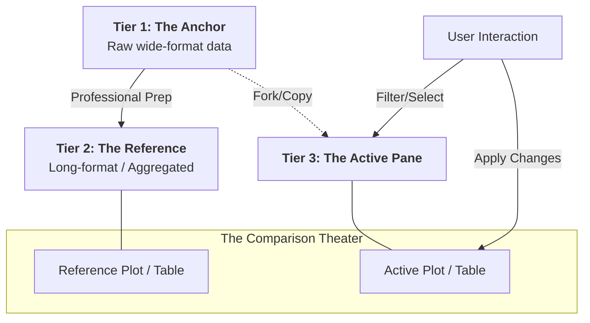

## 1. The Philosophy: Why Not Just One Dataset?

Exploring large scientific datasets is often a trade-off between **safety** (not breaking the data) and **speed** (getting plots instantly). SPARMVET uses a **3-Tiered Data Lifecycle** to give you both.

Imagine you are a Chef in a high-pressure kitchen:

| Tier | Analogy | Tech Role | Interaction |
|---|---|---|---|
| **Tier 1: The Anchor** | **The Pantry** | Raw Parquet (Wide) | **Read-Only.** Constant and safe. |
| **Tier 2: The Branch** | **The Prep Station** | Plot-Ready (Long/Agg) | **Reference.** Pre-chopped for the plot. |
| **Tier 3: The Leaf** | **The Frying Pan** | Your Active Dish | **Interactive.** Your filters & choices. |

## 2. The 3-Tier Workflow

::: {.lightbox}

:::

### Tier 1: The Anchor (The Giant Library)
This is your "Source of Truth." It's stored in a high-performance format (Parquet). In the dashboard, you can browse this in the **Reference Pane** to check original sample IDs or dates, but you cannot change it. 

### Tier 2: The Reference (The Professional Template)
Most plots require data to be reshaped (e.g., from "Wide" to "Long" format). We do this hard work for you. Tier 2 represents the data exactly as the standard plot expects it. 

### Tier 3: The Leaf (Your Creative Space)
When you start the dashboard, Tier 3 is an exact copy of Tier 1 that "inherits" the formatting from Tier 2. This is where you work. You can:
- **Filter**: "Show me only samples from 2020."
- **Select**: "Ignore these specific outliers."
- **Transform**: "Rename this category for the legend."

## 3. The Studio Shell: 3-Column Architecture

The dashboard is organized into three distinct operational zones to ensure a high-density, focused workspace.

### The Left Panel (The Navigator 🗺️)
- **Purpose**: Global context and project management.
- **Controls**: Project Selection, Persona Switching, and Global Agnostic Filters.
- **Rules**: Persist across all modules but are collapsible to maximize theater space.

### The Central Theater (The Map & Canvas 🎨)
- **Structure**: A 50/50 split layout optimized for side-by-side comparison.
- **ID Sanitation**: This zone uses **Dynamic ID Pivots (ADR-036)**. Every time you switch modules, the theater is forcefully cleared and rebuilt to prevent "ghost" data from stale sessions.
- **Centering**: All primary titles and guidance cards are centered via flex-alignment for a premium forensic feel.

### The Right Sidebar (The Audit Stack 📜)
- **Purpose**: Transparency and reproducibility.
- **Reset Sync**: The blue **Reset Sync** button allows you to instantly revert your Tier 3 workspace back to the Tier 2 baseline.
- **Order**: Your transformations are stacked visually, showing exactly how the "Leaf" data differs from the "Anchor."

## 4. Position-Aware Recipes: Before vs. After

In the **Audit Panel** (Right Sidebar), the order of your steps matters:

1.  **Steps ABOVE the "Inherited" block**: These are applied to the raw data *before* it's formatted. 
    *   *Best for*: Removing outliers or filtering entire years.
2.  **Steps BELOW the "Inherited" block**: These are applied *after* the data is formatted. 
    *   *Best for*: Selecting specific genes or categories that only appear after the data is "melted."

## 5. Summary Matrix for Users

| Feature | Reference Pane (Left) | Active Pane (Right) |
|---|---|---|
| **Data Format** | Toggleable (Wide/Long) | Usually Wide (for ease) |
| **Recalculation** | Never | Only on **▶ Apply** |
| **Modification** | **Impossible** (Locked) | Fully Interactive |
| **Label** | `"⚠️ View-only: For inspection"` | `"⚡ Workspace: Your Canvas"` |

---

> [!TIP]
> **Why the "Apply" Button?**
> Scientific data can be huge. If the dashboard recalculated every time you typed a letter in a filter box, it would lag. The **▶ Apply** button gives you control—build your transformation strategy, then execute it all at once.
