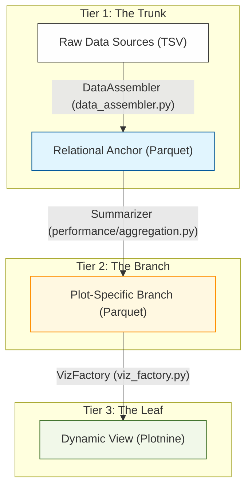

## How it Works: The "Prepped Chef" Analogy
To understand why SPARMVET_VIZ is so fast, imagine a professional kitchen preparing a complex dish:

1.  **Tier 1 (The Base Stock)**: Instead of boiling bones for 12 hours every time a customer orders, the chef makes a massive batch of **Base Stock** once a day. This is the **Relational Anchor**—all the raw data joined and cleaned.
2.  **Tier 2 (The Reduced Sauce)**: When a group of customers orders steak, the chef takes some base stock and reduces it into a specialized **Sauce**. This is the **Branching Summary**—data filtered and aggregated for a specific set of plots.
3.  **Tier 3 (The Garnish)**: The final seasoning added just before the plate hits the table. This is the **Dynamic View**—the last-second filters you apply in the dashboard.

**The "Reverse Short-Circuit" Rule**: Before the chef starts boiling water, they **check the fridge**. If the reduced sauce (Tier 2) is already there, they use it. If not, they check for the base stock (Tier 1). Only if both are missing do they start from scratch with raw ingredients.
The "Anchor" is the heavy, 100% computed outcome of the Wrangling and Multi-Join Pipeline. Logic applied here corresponds to a common data source (identified by ID or Path) and is shared by ALL plots dependent on that source. 

- **Implementation**: The **`Anchor (persistence/anchor.py)`** component executes the materialization via `pl.sink_parquet()`.
- **The Execution State:** It runs in `LazyFrame` mode, meaning nothing actually enters RAM until `.sink_parquet()` is called. 
- **The Process**: Polars streams the dataset directly to disk at `tmp/session_anchor.parquet`. It handles massive GB-scale data effortlessly.
- **Trigger**: Evaluated ONLY during initial system launch or when the underlying dataset/YAML configuration is modified. This acts as a physical circuit breaker against repetitive execution.
- **Path Authority**: Physical persistence paths are resolved via the **Connector** layer (`config/connectors/`). Hardcoding paths like `tmp/session_anchor.parquet` is forbidden in production; the system uses dynamically resolved system endpoints to ensure modularity.
- **Short-Circuit**: The `DataAssembler (data_assembler.py)` intelligently detects existing anchors and skips Layer 1/2 processing.
- **Automated Freshness Check (ADR-024 Refinement)**: To prevent stale data issues, the system implements a **Decision Metadata Hashing** mechanism. A SHA-256 fingerprint is generated from the manifest's assembly recipe and compared against the `sparmvet_decision_hash` embedded in the Parquet file's metadata. If the fingerprint doesn't match the current logic, the Short-Circuit is automatically invalidated, ensuring the pipeline always reflects the latest manifest changes without manual cache clearing.

## Tier 2 (The Branch): Plot-Specific Summary (Summarizer (performance/aggregation.py))
The "Branch" is a micro-dataset or pre-aggregated summary explicitly requested by a functional group of plots.
- **Logic**: Shared filters or `pl.group_by().agg()` that reduce row counts from millions to thousands before the VizFactory hand-off.
- **Execution**: The **`Summarizer (performance/aggregation.py)`** calls `pl.scan_parquet` against the Tier 1 Trunk.
- **Persistence**: Like Tier 1, branches can be persisted to disk at `tmp/branch_summary.parquet` via the `sink_parquet` action. The `DataAssembler` uses the same short-circuit logic to skip branch creation if the file exists.

## Tier 3 (The Leaf): Dynamic View (VizFactory (viz_factory.py))
The "Leaf" is the final state of the data as it enters the plotting engine. 
- **Instruction**: Predicate pushdown logic (filtering/selection) that is unique to a single panel or small set of panels.
- **Reactivity (Memory Array)**: To ensure rapid exploration, Tier 3 maintains a "Memory Array" of inherited Tier 2 nodes. A UI toggle allows users to view data with or without these pre-filled steps instantly via Polars' lazy evaluation—without losing the underlying recipe.
- **Performance**: Enforced via Polars' lazy evaluation, ensuring the smallest possible footprint enters the Plotnine/Matplotlib rendering pipeline.
