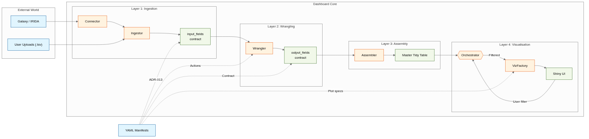

## The Problem {.smaller}

::: {.incremental}
- SOA8 ST 2.2 — visualisation tool for species pipeline results
- Most pipelines not yet decided or implemented when visualisation work starts
- Minimum metadata requirements still being defined
- First results arrive as xlsx/TSV → **no visualisation without custom scripts**
- Don't know what to visualise until the need to **publish**
- Different users: automated Galaxy pipeline · independent researcher · developer
- Every exploratory question requires **re-running the assembly** — slow, undocumented
- Filtering a bad sample? **No record of why it was removed**
- New species pipeline? **Back to writing Python**
- Must run on Galaxy, IRIDA, local server, laptop — **same tool, different deployment**
:::

::: {.notes}
Context: Abromics Galaxy EU + VIGAS-P combined analyses. Pipeline personas are for production; developer/advanced personas for exploration. The tool needs to serve all three user types without code changes — only YAML + persona config.
:::

---


# SPARMVET_VIZ

::: {style="font-size: 1.1em; margin-top: 0.5em;"}
**One YAML-driven tool** that turns any tabular pipeline output into publication-ready, reproducible visualisations — without writing Python.

Adaptable from fully automatic (Galaxy) to fully exploratory (researcher sandbox), through a single persona config.
:::


## What We Built {.smaller}

::: {.highlight-box}
**One manifest-driven tool** — add a new pipeline visualisation by writing a YAML file, not Python.
:::

::: {.incremental}
- **Reusability** — works on any tabular data; new pipeline = new YAML manifest
- **Publication quality** — plotnine/matplotlib static figures + export bundle with full methods
- **Transparency** — every filter, wrangling step, and user decision is logged with a reason
- **Reproducibility** — three-layer SHA-256 fingerprint (manifest + raw data + wrangling recipe); session tied to exact data batch
- **Adaptability** — persona system gates features per deployment context
- **Deployable anywhere** — Galaxy, IRIDA, local server, laptop; same code base
- **Shareable** — export bundle ships manifest + audit trail + data hashes; anyone can rerun
- **Inspiration** — Gallery of 34 recipes with 6-axis taxonomy; community-driven growth
:::

::: {.notes}
The three hashes: decision_hash (wrangling recipe, stored in Parquet metadata for cache invalidation), manifest_sha256 (YAML file bytes, session identity), data_batch_hash (raw source file bytes, protects against silent T3 carryover when data updates). All three appear in every export README and report. See ADR-066.
:::

---


## Who Gets What: Persona × Feature Matrix {.smaller}

<table class="heatmap-table" style="width:100%; border-collapse: collapse;">
<thead>
<tr>
  <th class="cell-name">Persona</th>
  <th class="group-header" colspan="2" style="background:#e3f2fd">View / Explore</th>
  <th class="group-header" colspan="4" style="background:#c8e6c9">T3 — Justified Edits</th>
  <th class="group-header" colspan="3" style="background:#ffe0b2">Data Ingestion</th>
  <th class="group-header" colspan="3" style="background:#f3e5f5">Developer</th>
</tr>
<tr>
  <th></th>
  <th style="font-size:0.6em">Export bundle</th>
  <th style="font-size:0.6em">Filters / T1↔T2</th>
  <th style="font-size:0.6em">Justified edits</th>
  <th style="font-size:0.6em">Compare T2/T3</th>
  <th style="font-size:0.6em">Session save</th>
  <th style="font-size:0.6em">Audit report</th>
  <th style="font-size:0.6em">Metadata upload</th>
  <th style="font-size:0.6em">Import helper</th>
  <th style="font-size:0.6em">Data ingest</th>
  <th style="font-size:0.6em">Gallery</th>
  <th style="font-size:0.6em">Blueprint</th>
  <th style="font-size:0.6em">Test Lab</th>
</tr>
</thead>
<tbody>
<tr>
  <td class="cell-name">pipeline-static <span style="font-size:0.75em;color:#888">/ demo-vetinst</span></td>
  <td class="cell-yes">✅</td><td class="cell-no">—</td>
  <td class="cell-no">—</td><td class="cell-no">—</td><td class="cell-no">—</td><td class="cell-no">—</td>
  <td class="cell-no">—</td><td class="cell-no">—</td><td class="cell-no">—</td>
  <td class="cell-no">—</td><td class="cell-no">—</td><td class="cell-no">—</td>
</tr>
<tr>
  <td class="cell-name">pipeline-exploration-simple</td>
  <td class="cell-yes">✅</td><td class="cell-yes">✅</td>
  <td class="cell-no">—</td><td class="cell-no">—</td><td class="cell-no">—</td><td class="cell-no">—</td>
  <td class="cell-no">—</td><td class="cell-no">—</td><td class="cell-no">—</td>
  <td class="cell-no">—</td><td class="cell-no">—</td><td class="cell-no">—</td>
</tr>
<tr>
  <td class="cell-name">pipeline-exploration-advanced</td>
  <td class="cell-yes">✅</td><td class="cell-yes">✅</td>
  <td class="cell-yes">✅</td><td class="cell-yes">✅</td><td class="cell-yes">✅</td><td class="cell-yes">✅</td>
  <td class="cell-yes">✅</td><td class="cell-no">—</td><td class="cell-no">—</td>
  <td class="cell-no">—</td><td class="cell-no">—</td><td class="cell-no">—</td>
</tr>
<tr>
  <td class="cell-name">project-independent</td>
  <td class="cell-yes">✅</td><td class="cell-yes">✅</td>
  <td class="cell-yes">✅</td><td class="cell-yes">✅</td><td class="cell-yes">✅</td><td class="cell-yes">✅</td>
  <td class="cell-yes">✅</td><td class="cell-yes">✅</td><td class="cell-yes">✅</td>
  <td class="cell-yes">✅</td><td class="cell-no">—</td><td class="cell-no">—</td>
</tr>
<tr>
  <td class="cell-name" style="color:#345beb">developer</td>
  <td class="cell-yes">✅</td><td class="cell-yes">✅</td>
  <td class="cell-yes">✅</td><td class="cell-yes">✅</td><td class="cell-yes">✅</td><td class="cell-yes">✅</td>
  <td class="cell-yes">✅</td><td class="cell-yes">✅</td><td class="cell-yes">✅</td>
  <td class="cell-yes">✅</td><td class="cell-yes">✅</td><td class="cell-yes">✅</td>
</tr>
</tbody>
</table>

::: {.tier-label}
Persona (configuration file) controls UI features. Deployment profile controls which pipeline loads. Fully independent.
**Compare T2/T3** = see what your justified edits changed — requires T3 sandbox to be meaningful.
:::

---

## DEMO {background-color="#0a1628"}

::: {style="color: white; text-align: center; font-size: 1.4em; padding: 1.5em 0 0.5em 0;"}
**→ Switch to the app**
:::

::: {.incremental style="color: #a0c4ff; font-size: 0.9em;"}
**Phase 1** — port 8001 · NVI branding · no controls (demo-vetinst persona)

**Phase 2** — port 8002 · T1/T2/T3 · filters + audit + export (pipeline-exploration-advanced)

**Phase 3** — port 8003 · all features (developer)
:::

::: {style="color: #6c757d; font-size: 0.7em; margin-top: 1.5em;"}
Cheatsheet: `presentation/demo_cheatsheet.md`
:::

::: {.notes}
Start Phase 1 immediately — NVI teal/gold banner, no sidebar. Fast brand demo.
Then switch to Phase 2 for T1↔T2 toggle, T3 filters, propagation, audit, export bundle.
Phase 3 for Gallery (34 recipes), Cat/Miaou, Blueprint (show honestly as "in dev"), Test Lab.
:::

---

# Part B — Architecture & Q&A {background-color="#1a1a2e" style="color: white;"}

::: {style="color: #a0c4ff; font-size: 0.85em;"}
Keep on second screen during demo · use for discussion
:::

---

## How Data Flows: Three Tiers {.smaller}

```{mermaid}
graph TD
    subgraph T1["T1 — per-source materialization (cached Parquet)"]
        Raw["Raw TSV / Galaxy / IRIDA"] -->|"Ingestor"| W1["Wrangling\nnormalize · cast · filter QC"]
        W1 --> P1["Parquet  🔒 decision_hash"]
    end
    subgraph T2["T2 — cross-source assembly (cached Parquet)"]
        P1 -->|"Assembler"| W2["Additional wrangling\njoin · aggregate · unpivot"]
        W2 --> P2["Analysis-Ready Anchor  🔒 decision_hash"]
    end
    P2 -->|"VizFactory"| Plot["Plot (Plotnine → PNG)"]
    P2 -.->|"user filters\n(branch — T2 unchanged)"| T3["T3 sandbox\nRow filters · aesthetic overrides\nReset → back to T2"]
    T3 --> Plot2["Plot (filtered)"]
    style T1 fill:#e1f5fe,stroke:#01579b
    style T2 fill:#fff8e1,stroke:#ff8f00
    style T3 fill:#f1f8e9,stroke:#33691e,stroke-dasharray:4
```

::: {.tier-label}
T1/T2 split = caching boundary, not a strict rule. T1 per-source; T2 cross-source joins. Both hashed.
T3 **branches from T2** — reset discards the branch, T2 is untouched. Scope permanently locked to row filters + aesthetics only.
:::

::: {.notes}
T3 is NOT a wrangling sandbox. It cannot modify the manifest. The scope lock is an architectural guarantee, not a permission flag.
T1/T2 split is somewhat arbitrary — allows caching at two levels so an expensive join (T2) is not recomputed when only a different plot is requested. T1 can be shared across multiple T2 assemblies.
:::

---

## What the Three Tiers Mean {.smaller}

::: columns
::: {.column width="50%"}
**Tier 1 — per-source materialization**

Each raw source file is independently:
- ingested through column contracts (`input_fields`)
- normalized: type casting, whitespace stripping, QC wrangling
- cached as Parquet with a `decision_hash`

T1 is **reusable** — one ResFinder T1 feeds multiple T2 assemblies.
Cold-start (first load): minutes. Warm: milliseconds.

**Tier 2 — cross-source assembly**

Takes T1 anchors as ingredients, runs:
- joins, aggregations, unpivots across datasets
- additional wrangling steps in `assembly_manifests`
- cached as Parquet with its own `decision_hash`

T1/T2 split is a **caching boundary**, not a strict rule.
Its purpose: avoid recomputing expensive joins when only
a different plot from the same anchor is requested.
:::

::: {.column width="50%"}
**Tier 3 — your sandbox (branch from T2)**

T3 does **not** modify T1 or T2. It branches:

- Row filters: keep/exclude samples by column condition
- Aesthetic overrides: color, shape, fill mappings
- Scope **permanently locked** to these two operations
- Reset → branch discarded, T2 rendered unchanged

T3 is where audit happens: every filter gets a reason,
logged with timestamp. Compare T2/T3 = see the delta.

::: {.highlight-box}
**Double hash = reproducibility anchor**

`session_key = manifest_sha256[:12] : data_batch_hash[:12]`

- `manifest_sha256` — SHA256 of the YAML file itself
- `data_batch_hash` — SHA256 of **every raw source file**
- `decision_hash` — SHA256 of the wrangling recipe

Same manifest + same raw data → same session key → reproducible. Export bundle ships all three.
:::
:::
:::

::: {.notes}
The data_batch_hash is computed over the raw source file bytes (not processed data). This means if raw data is updated (new Galaxy run), the session key changes and T3 state does not silently carry over to a different data batch.
:::

---

## Anatomy of a Manifest {.smaller}

::: columns
::: {.column width="52%"}
```yaml
id: ST22_dummy_manifest
type: species
info:
  display_name: "ST22 AMR Dataset"  # → nav title

data_schemas:            # one block per source file
  ResFinder:
    source:
      type: local_tsv         # → connector class
      path: ./data/resfinder.tsv
    input_fields:        # → column contracts (T1 ingestor)
      sample_id: {type: categorical, is_primary_key: true}
      gene:      {type: categorical}
      identity:  {type: numeric}
    wrangling:           # → T1 wrangling actions
      tier1:
        - action: filter_rows
          column: identity
          operator: gte
          value: 90
    output_fields:       # → T2 contract
      sample_id: {type: categorical}
      gene:      {type: categorical}

assembly_manifests:      # cross-source joins → T2 anchors
  ResFinder_with_metadata:
    ingredients:
      - dataset_id: ResFinder
      - dataset_id: metadata_schema
    recipe:
      tier1:
        - action: join
          right_ingredient: metadata_schema
          on: [sample_id]

analysis_groups:         # → nav tabs / plot groups in UI
  AMR Results:
    plots:
      amr_heatmap:
        spec:
          factory_id: heatmap_logic   # → VizFactory recipe
          target_dataset: ResFinder_with_metadata
          x: gene
          y: sample_id
          fill: identity
```
:::

::: {.column width="48%"}
::: {.highlight-box}
**5 YAML sections → entire UI**
:::

**`source.type`** → selects the connector
(`local_tsv`, `galaxy_schema_id`, …)

**`input_fields`** → column contracts checked at ingest (T1)

**`wrangling`** → declarative actions vocabulary
(join, filter, unpivot, cast…) — no Python per pipeline

**`output_fields`** → T2 contract for downstream joins

**`assembly_manifests`** → cross-source joins/aggregations
→ named *anchors* (the TubeMap rails)

**`analysis_groups`** → nav tabs + VizFactory calls
(`factory_id` + aesthetics = one plot)

::: {.tier-label}
No new Python written for the 9 ST22 plots.
New geom types or new wrangling actions outside the
existing vocabulary do require Python — written once,
reused by all pipelines.
The Blueprint Architect will let scientists wire this
visually — no YAML by hand. *(in development)*
:::

:::
:::

::: {.notes}
⭐ REMEMBER: show the Blueprint TubeMap in the app (Phase 3 → Blueprint in sidebar → ST22 lineage DAG) — it renders this exact assembly graph visually. That's the "aha" moment for scientists who don't want to write YAML.

The wrangling actions are a vocabulary: join, filter_rows, unpivot, split_and_explode, cast, drop_duplicates, etc. All defined in ADR-013. Adding a new action = one Python function in the wrangler library; no changes needed in any manifest.
:::

---

## Hash Schema & Reproducibility {.smaller}

::: columns
::: {.column width="52%"}
**Three hashes, one reproducibility guarantee**

```
# 1. Recipe hash — cache invalidation
decision_hash = SHA256(wrangling_recipe_dict)
→ stored in Parquet metadata block
→ if manifest changes: cache stale, recompute

# 2. Manifest file hash — session identity
manifest_sha256 = SHA256(manifest_yaml_bytes)

# 3. Raw data hash — data identity
data_batch_hash = SHA256(
    sorted per-file SHA256s of all source TSVs
)

# Session key = both together
session_key = manifest_sha256[:12] + ":" + data_batch_hash[:12]
```

Staleness check = metadata read only, no data scan → microseconds.
:::

::: {.column width="48%"}
**Why this matters**

- Manifest wrangling step changes → `decision_hash` changes → T1/T2 recomputed automatically
- New Galaxy run (different raw data) → `data_batch_hash` changes → new session, T3 state does not carry over silently
- Same manifest + same raw files → **identical session key** → reproducible across machines
- Export bundle ships manifest + audit trail → anyone can verify

::: {.highlight-box}
The export ZIP is a **reproducible methods package**: recipe + raw data fingerprint + every justified edit.
:::
:::
:::

::: {.notes}
decision_hash fingerprints the wrangling recipe (what decisions produced this Parquet). manifest_sha256 fingerprints the YAML file. data_batch_hash fingerprints the raw source bytes — if the Galaxy pipeline reruns and updates the TSV, the hash changes and the session does not silently reuse old T3 filters on new data.
:::

---

## Session Save & Export Bundle {.smaller}

::: columns
::: {.column width="48%"}
**Session save** *(manual — no autosave yet)*

Saves your work-in-progress to disk under a session key:

`session_key = manifest_hash[:12] : data_hash[:12]`

What gets saved:

- T3 filter nodes per plot (row filters + aesthetic overrides)
- Audit trail (each decision + reason + timestamp)
- Assembly metadata (which manifest, which data batch)

**On reload:** system detects a matching session and offers to restore your T3 state. If the manifest changed since the save, you get a warning.

**Session export / import:** download the session as a ZIP → import on another machine. Useful for collaborative audits.

::: {.tier-label}
Session is scoped to one manifest + one data batch.
A new Galaxy run → new session key → no accidental carryover.
:::
:::

::: {.column width="52%"}
**Export bundle** *(publication package)*

Everything needed to reproduce and share results:

| File | Contents |
|---|---|
| `plots/` | Rendered figures (PNG/SVG) |
| `data/*_T1.tsv` | Raw assembled data |
| `data/*_T3.tsv` | Filtered data (when active) |
| `recipes/` | YAML manifest + wrangling recipe |
| `report.html` | Rendered Quarto report |
| `FILTERS.txt` | Filter trace |
| `README.txt` | Provenance + **all 3 hashes** |

The README contains:

```
Manifest SHA256 : <hash of YAML file>
Data SHA256     : <hash of raw source files>
Recipe hash     : see Parquet metadata
```

::: {.highlight-box}
**Session** = your work in progress, restorable.
**Export bundle** = the publication package, shareable.
Two different things. Both matter.
:::
:::
:::

::: {.notes}
Autosave (ghost_save) is configured in persona templates but currently disabled (enabled: false). Currently manual save only via the Session Management accordion button. This is a known gap — UX-NOTIF-2 tracks persisting the notification log; a future sprint could enable ghost_save timer.

⚠️ SESSION-PERSONA-1 (open): Session save is only meaningful for personas with t3_sandbox_enabled: true. Static and pipeline-static personas have no user-generated T3 state to save — the session would be identical on every load. The save button should be hidden/disabled for non-T3 personas. Behaviour for pipeline-exploration-simple (no T3 sandbox but has T1/T2 exploration) also needs clarification.

The session ZIP can be imported on a different machine as long as the same manifest and raw data are available — the session key will match and T3 state restores correctly. The export bundle is self-contained and does not require the live app to use.
:::

---

## System Architecture {.smaller}

{width="100%" .lightbox}

::: {.tier-label}
YAML manifest drives every layer. Each layer independently testable. **Shiny UI is kept as thin as possible** — no business logic (data compute) above the Orchestrator.
:::

::: {.notes}
YAML manifest drives every layer via dotted connections. The library stack: connector → transformer (ingestor + wrangler + assembler) → viz_factory → Shiny handlers. All decoupled; each layer is independently testable.
:::

---

## A Real Deployment: ST22 Pipeline Map {.scrollable}
# TODO - I would like the full picture as png 
::: {.tier-label}
Key point: **same source data → multiple assembly anchors → different plots**. Branching is defined in YAML — no code per branch.
:::
```{mermaid}
graph LR
classDef trunk   fill:#0d6efd,stroke:#fff,color:#fff
classDef ref     fill:#6c757d,stroke:#fff,color:#fff
classDef meta    fill:#fd7e14,stroke:#fff,color:#fff
classDef wrangle fill:#ffc107,stroke:#555,color:#212529
classDef branch  fill:#9c27b0,stroke:#fff,color:#fff
classDef plot    fill:#198754,stroke:#fff,color:#fff

FastP(["Reads Quality"]):::trunk
Quast(["Assembly Quality"]):::trunk
Bracken(["Taxonomy"]):::trunk
ResFinder(["AMR genes"]):::trunk
MLST(["MLST"]):::trunk
VirFinder(["Virulence ref"]):::ref
metadata(["Metadata"]):::meta

QC_Anchor{"QC Anchor"}:::branch
ST22_Anchor{"ST22 Anchor"}:::branch
MLST_meta{"MLST+meta"}:::branch

FastP --> QC_Anchor
Quast --> QC_Anchor
Bracken --> QC_Anchor
metadata --> QC_Anchor
metadata --> ST22_Anchor
FastP --> ST22_Anchor
ResFinder --> ST22_Anchor
MLST --> ST22_Anchor
VirFinder --> ST22_Anchor
metadata --> MLST_meta
MLST --> MLST_meta

QC_Anchor --> qc_bar[["QC Reads Bar"]]:::plot
Quast --> qc_dot[["Assembly Dotplot"]]:::plot
ST22_Anchor --> vir_bar[["Virulence Bar"]]:::plot
ST22_Anchor --> vir_var[["Virulence Variants"]]:::plot
MLST_meta --> mlst_bar[["MLST Bar"]]:::plot
MLST_meta --> yr_dist[["Year Distribution"]]:::plot
ResFinder --> amr_heat[["AMR Heatmap"]]:::plot
Quast --> miaou[["Miaou 🐱"]]:::plot
```

::: {.tier-label}
9 source files → 3 assembly anchors → 9 plots. All wiring defined in YAML — no Python.
:::

---

## How We Build It {.smaller}

::: columns
::: {.column width="50%"}
**Architecture Decision Records (ADRs)**

- Every structural decision is documented: ADR-001 → ADR-065
- Decisions are versioned, not overwritten
- Each ADR has a *why*, not just a *what*
- Example: ADR-010 "Polars everywhere" (Lazzy Eval) — no Pandas until the final render step 

**Rules files** (`.agents/rules/`)

- Governing documents for every layer
- Agents and developers read these before touching code
- Violations flagged in automated audits
:::

::: {.column width="50%"}
**Testing pyramid**

- Unit tests: filter operators, persona validator, connector, VizFactory components
- Integration: Playwright smoke tests (T1→T4, 163 tests)
- CI: `SPARMVET_PERSONA=qa` — deterministic, no ghost saves

**Audit protocol**

- Exhaustive architectural audit before every sprint
- Pre-audit baseline snapshot tagged in git
- Wave-based remediation with tracked completion
- Dependency graph (117 nodes, 222 edges) auto-generated from `@deps` annotations
:::
:::

::: {.notes}
The ADR process is how we prevent architectural drift. Rules files govern both human developers and AI agents. The @deps annotation system gives us a live dependency graph that updates with every session (when not forgotten).
:::

---

## Documentation {.smaller}

::: columns
::: {.column width="60%"}
Built with **Quarto** — 45 pages from `docs/`

- User guides: filters, export, persona, audit pipeline
- Developer vs. non-coder user guide: separate paths
- Reference: VizFactory, manifest structure, wrangling guide
- Appendix: terminology, FAQ, T3 rationale, gallery taxonomy
- Style guide: CSS customisation reference (ADR-065)

```bash
xdg-open _book/index.html
```
:::

::: {.column width="40%"}
**Dependency graph**

117 annotated nodes · 222 edges
Auto-generated from `@deps` blocks

```bash
# Any browser with HTTP server (auto-loads JSON):
python3 -m http.server 8080
# → http://localhost:8080/assets/dep_graph.html

# Brave direct file access:
brave-browser --allow-file-access-from-files \
  assets/dep_graph.html
```

Dotted = `consumed_by` · Solid = `consumes`
:::
:::

---

## Roadmap: Data Science & Epidemiology {.smaller}

::: columns
::: {.column width="33%"}
**Further Testing - Deployment**
- Connector and deployment: API (Galaxy, IRIDIA) container ...
- Developer mode / Gallery / LAB ... (if/when possible)

**Interactivity**
*(researched ✅)*

Plotly + `shinywidgets` layer on top of existing static render path
- Hover for exact n/% per data point
- Click bar → filter data preview
- Zoom into date ranges
- Cross-filter between plots

*Static plotnine remains canonical publication artifact*
:::

::: {.column width="33%"}
**Geospatial maps**
*(researched ✅)*

Interactive choropleth: Plotly from raw GeoJSON — **no geopandas, no GDAL** required

- Country/region-level AMR prevalence maps
- Works on Galaxy/HPC without compiled extensions
- Static `geom_map` (geopandas) deferred — harder dependency story

*Interactive path is unblocked today (unsure)*
:::

::: {.column width="33%"}
**Time series & epicurves**
*(researched ✅)*

`geom_line`, `geom_area`, `geom_smooth` already registered in VizFactory

Missing: trend wrangling actions, interrupted time series (ITS), rolling window assembly steps

- NORM-VET, EFSA, EARS-Net style surveillance trends
- Seasonal decomposition
- Year-over-year AMR change detection
:::
:::

::: {.tier-label}
Shared infrastructure: `shinywidgets` + Plotly unlocks interactivity, maps, and time series in one work package. Research notes in `EVE_WORK/ENHANCEMENTS/`.
:::

---

## Roadmap: Bioinformatics Visualisation {.smaller}

::: columns
::: {.column width="33%"}
**Sequence alignment (MSA)**

- `pymsaviz` — matplotlib MSA renderer (pip, no compiled deps)
- Sequence logos: `logomaker`
- Feasibility: **HIGH** — static matplotlib → fits existing VizFactory
- New ingestor needed: FASTA / CLUSTAL formats
:::

::: {.column width="33%"}
**Phylogenetic trees**

- `toytree` or `ete3` — matplotlib tree rendering
- Annotatable (AMR calls, metadata per leaf)
- Feasibility: **MEDIUM** — matplotlib output fits; need Newick/NHX ingestor
- Tree layout ≠ tabular → new manifest schema block needed 
- OR check if possible to do as in R : tabular tree data ! 
:::

::: {.column width="33%"}
**Genome annotation tracks**

- `dna_features_viewer` or `pyGenomeTracks` — IGV-style static tracks
- Feasibility: **MEDIUM** — GFF3/GenBank ingestor needed; coordinate-based rendering is architecturally different from plot-based
:::
:::

::: {.highlight-box}
**Common pattern:** all are Python/matplotlib → static output fits VizFactory. The challenge is **new data formats** (FASTA, Newick, GFF3) needing new ingestor types. Architectural extension, not replacement. One work package for ingestor + manifest schema extension unlocks all three.
:::

---

## Vision {background-color="#0d1117"}

::: {style="color: white; text-align: center; padding: 2em;"}

**One tool to Rule them all!**

Any tabular data, Many species, Many pipelines.

::: {style="font-size: 0.85em; color: #a0c4ff; margin-top: 1em;"}
Add a pipeline: write a YAML manifest.
Add a visualization: add a recipe to the Gallery.
Add a user type: configure a persona.
Reproduce a publication figure: export the audit bundle.
:::

::: {style="font-size: 0.75em; color: #6c757d; margin-top: 2em;"}
The more pipelines use it → the more recipes in the Gallery →
the more useful it becomes for the next pipeline.
:::

:::

::: {.notes}
VIGAS-P will need visualization. 
This tool is designed to serve it without rewriting anything — just new manifests. 
The gallery grows with every new use case.
:::
